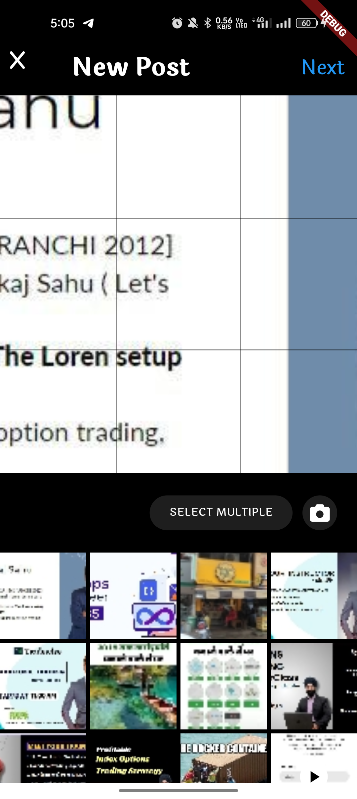

picker_instagram

A Flutter package for picking images or the videos or both from the Gallery.

Getting Started
This plugin displays a gallery with user's Instagram Albums and Photos,

Usage

1. Add dependency

Please check the latest version before installation. If there is any problem with the new version, please use the previous version

dependencies:
flutter:
sdk: flutter

# add picker_instagram

picker_instagram: ^{latest version}

2.  Add the following imports to your Dart code

import 'package:picker_instagram/picker_instagram.dart';

3. Simply Call this:

class ExampleScreen extends StatefulWidget {
const ExampleScreen({super.key});

@override
State<ExampleScreen> createState() => \_ExampleScreenState();
}

class \_ExampleScreenState extends State<ExampleScreen> {
@override
Widget build(BuildContext context) {
return Scaffold(
body: Center(
child: ElevatedButton(
onPressed: () {
PickerInstagram.instagramPicker(
type: PickerInsta.both,
onComplete: (value) {
Get.back();
if ((value ?? []).isNotEmpty) {
Get.to(
() => PreviewAssetPickedScreen(
preViewList: value ?? [],
),
);
}
},
);
},
child: const Text('pick images'),
),
),
);
}
}

To use this package, ensure you have added the required permissions to your `AndroidManifest.xml` and `Info.plist` files as shown below:

#### Android

```xml
<manifest xmlns:android="http://schemas.android.com/apk/res/android"
    package="com.yourcompany.yourpackage">


 <uses-permission android:name="android.permission.READ_EXTERNAL_STORAGE"/>
  <uses-permission android:name="android.permission.WRITE_EXTERNAL_STORAGE"/>
 <uses-permission android:name="android.permission.MANAGE_EXTERNAL_STORAGE"/>
 <uses-permission android:name="android.permission.READ_MEDIA_IMAGES" />
 <uses-permission android:name="android.permission.READ_MEDIA_VIDEO" />
 <uses-permission android:name="android.permission.READ_MEDIA_VISUAL_USER_SELECTED" />

<application
....
 />
</manifest>


#### IOs

<?xml version="1.0" encoding="UTF-8"?>
<!DOCTYPE plist PUBLIC "-//Apple//DTD PLIST 1.0//EN" "http://www.apple.com/DTDs/PropertyList-1.0.dtd">
<plist version="1.0">
<dict>
	...

   <key>NSCameraUsageDescription</key>
   <string>your usage description here</string>
   <key>NSMicrophoneUsageDescription</key>
   <string>your usage description here</string>
   <key>NSPhotoLibraryUsageDescription</key>
   <string>We need access to your photo library to select and upload photos.</string>
   <key>NSPhotoLibraryAddUsageDescription</key>
   <string>We need access to save photos to your photo library.</string>

</dict>
</plist>


Screenshots




```
